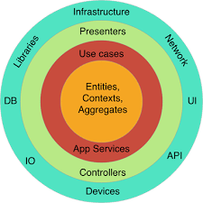

# Domain Driven Design (DDD)

- The layers from inside should not know what's in outside of the layer. F.e: The entities layer should not know the database application. because they're independent.

- DTO (Data Transfer Object): The contract to make the inputs and outputs object transference

