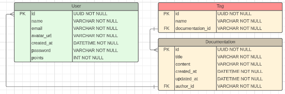

# Databases

## Relational

### What is?
A relational database is a type of database that organizes data into tables and establishes relationships between those tables using keys. Keys are unique identifiers that are used to link records between tables, creating relationships.

When a unique identifier, known as a `primary key (PK)`, is used in another table to reference a record, it is called a `foreign key (FK)` in the associated table.

The connections between primary and foreign keys create relationships between tables, allowing for efficient data retrieval and manipulation.

  

### Advantages

`Referential Integrity`: The use of primary and foreign keys enforces rules that maintain data accuracy. When a record is updated/deleted, **all related records must also be changed**.

Foreign keys in a table must have corresponding primary keys in the referenced table, ensuring the integrity and validity of the relationships.

### Examples

Microsoft SQL Server, Oracle, PostgreSQL, SQLite, MySQL, Maria DB.

## Non-Relational

Aka NoSQL databases, are a type of database flexible to storing and retrieving data. Unlike relational database, they don't have predefined relationships and fixed table structures.

Instead of using tables, non-relational databases use various data models, such as key-value pairs, documents, graphs, or column families, to organize and represent data.

### Advantages

`Flexibility`: they have flexibility in data modeling, allowing developers to store and retrieve data in a way that best suits the application needs. 

### Types of non-relational databases

- `Document data stores`: JSON-like documents structured.
- `Columnar data stores`: Organized in columns, similar to relational database.
- `Key-Value Stores`: These databases store data as key-value pairs, making them ideal for caching, session management, and simple data storage and retrieval.
- `Graph Databases`: They excel at storing and querying highly interconnected data, making them suitable for applications involving social networks, recommendation engines, and complex relationships.

### Examples

MongoDB, Apache Cassandra, Redis, DynamoDB, Couchbase.