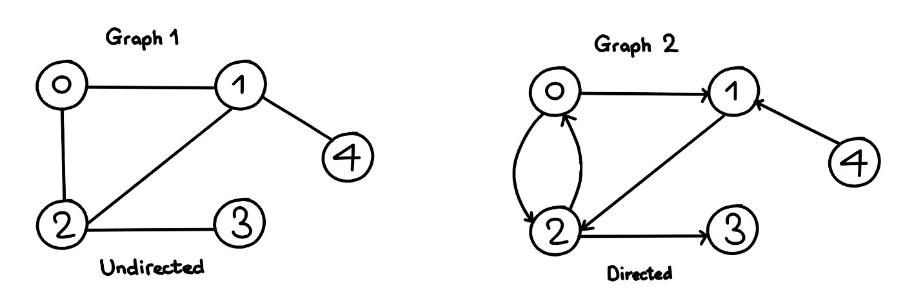
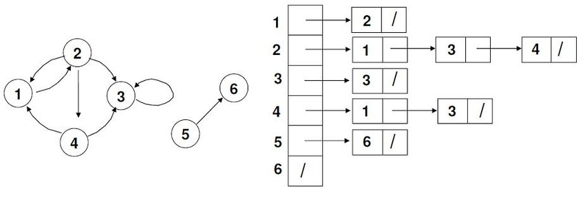
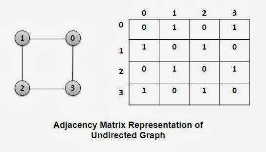
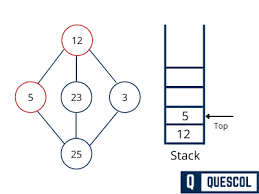
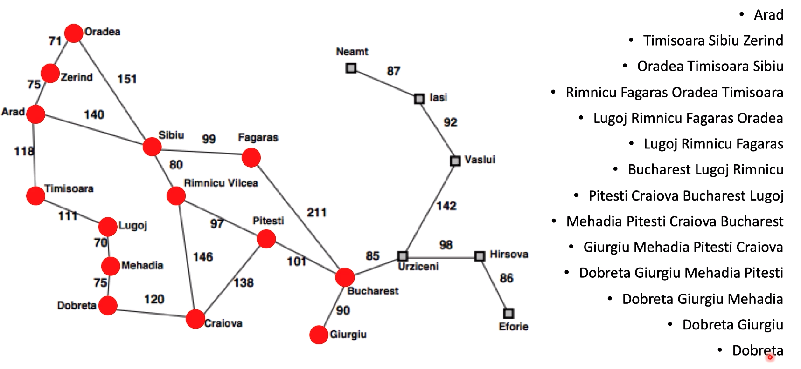

# 🌐 Graphs

- Abstract data type, made by a even **V, E**, with V being **Vertices** and E being **Edges** 
- Could be **Directed or Digraph** when Edges **has directions**
- Could be **No directed** with **no directions**
- Edges can have **weight**
- **Order**: Number of vertices

___

## 🤔 Examples of uses

- Social media (like Facebook)
- Maps
- Web pages
- Subway

___

## Graphs directed

- Connection **output** -> **Adjacents**
- If has **connections**, the elements connected are called **neighbors**
- **Grade of a vertice** it's the **number of edges** leaving the vertex + number of edges that arrive at the vertex
  (**adjacents vertices**)
- It's **strongly connected** if each edge can be **reachable** from **any** other

___

## Graphs not directed

- Symmetrical
- **Grade of a vertice** it's the **number of edges** that affect him (**adjacents vertices**)
- Is **connected** if each pair of vertices is connected **by a path**.

___

## Adjacency list

- Stack of **linked lists** with all the adjacents vertices.
- **Disadvantage**: to know if a Edge (u, v) exists, we need to make a **search** in the list of adjacents.
  

___

## Adjacency matrix

- Best to small graphs
- Use a **matrix format**, with a **V x V dimension** (Vertice x Vertice)
- **1: adjacency** with the value
- **0: no adjacency** with the value

___

# Searchs

## Depth-First Search - Stack

- Similar to pre-order search in trees
1. **Visit a adjacent** node **not visited** and push him on the stack.
2. If **has not adjacents not visited**, pop the value
3. If Rule 1 and Rule 2 is not the case, the search is finished. 

___ 

## Breadth-First Search - Queue 

1. **Visit a adjacent not visited, mark and push** on the queue.
2. If **has not a adjacent node, dequeue**
3. If Rule 1 and Rule 2 is not the case, the search is finished.
   

