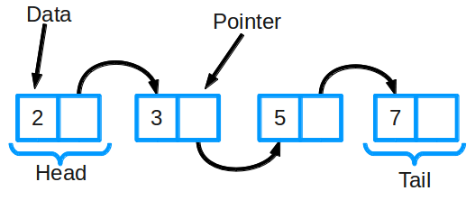
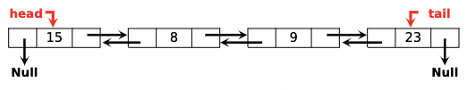

# 🔗 Lists

- The elements must have a **logic and fisic order** between them.
- Each element is called **Node** and we use as a array.
- Linked list

___

___

## 🤔 Examples of uses

- Can be implemented to make linked `Stacks` and `Queues` 
- Browser history (previous and next page)
- **RL** example: Image viewer, music player.

___

## Insertion Sort

- Receive a element and **reorganize** **other** **elements** to keep the new element.
- **Best case** is when all the elements are organized -> **O(n)**
- **Worst case** is when the elements are unorganized -> **O(nˆ2)**

___

## Allocation no sequencial and static

- Use a array
- Elements have a **logic order** to storage
- **Don’t** need to **move** other values
- Each elements **points** to the **next** value

___

## Allocation no sequencial and dynamic

- **Chained allocation**
- **Order** by **logic** order
- Each node have the **data** and the **next** value (by **pointer**)
- Indicates the **first** **element** and **follow** the **next** property
- Last value is None
- Don’t need to move other elements

___

