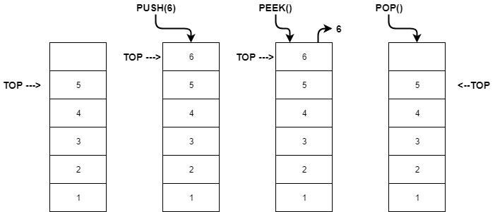
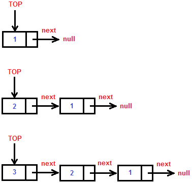

# 📚️ Pilhas (Stack) - Listas

- The **last** element to **enter**, is the **first** to **leave**.
- **LIFO** (**L**ast **I**n, **F**irst **O**ut).
- Stack **Overflow**: Push in a full list.
- Stack **Underflow**: Pop in a empty list.

___

___

## 🤔 Examples of uses

- Browser history 
- Backspace (poping the last keyinput)
- Undo functions (insert a value and delete the last inserted value), like `CTRL + Z`
- **RL** example: A stack of books.

___

# Stack static

- The size is **fixed**.
- Try to insert a **new** element in a **full** stack throws an **overflow** exception.

___

# Stack dynamic

- The size is **not fixed** and, consequently, has not the overflow problem.
- Each element has a **pointer**, pointing out to the **next** element of the stack.

___

