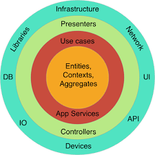

# Domain Driven Design (DDD)

- Which is an approach to software development that focuses on modeling the core domain of a business application and aligning the software design with the business domain.

___

___

## Some key concepts of DDD:

1. **Domain**: The domain represents the problem space or the subject area to which the software application relates. It comprises the business rules, concepts, and processes that are unique to the specific application. 

2. **Ubiquitous Language**: DDD emphasizes the use of a shared language, known as the ubiquitous language, between domain experts and developers. This language forms a bridge between the technical and business domains and ensures a common understanding of the domain model. *Ex.: In a bank, experts and developers use term "Account" to refer to a customer bank account.*

3. **Bounded Context**: In complex domains, different parts of the system may have distinct models and terminologies. It allows different parts of the system to have their own domain models that are isolated from each other. *Ex.: In a ecommerce, Order Management and Customer Management has its own domain model and logic*

4. **Aggregate**: An aggregate is a cluster of related domain objects treated as a single unit. It ensures consistency and enforces business rules within its boundaries. Aggregates have a root entity, known as the aggregate root, which acts as the entry point for accessing and modifying the internal objects.

5. **Entities and Value Objects**: Entities represent objects with unique identities and are defined by their attributes and behavior. Value objects, on the other hand, are objects without identities and are defined by their attributes only. 

6. **Domain Services:** Domain services encapsulate complex operations or behaviors that do not naturally fit within a specific entity or value object. They provide operations that act on multiple objects or orchestrate interactions between different aggregates. *Ex: In a shopping, PaymentService can handle complex operations.*

7. **Repositories**: Repositories provide an abstraction for accessing and persisting domain objects.

8. **Domain Events**: Domain events represent significant changes or occurrences within the domain. They capture and communicate important domain-specific information that other parts of the system can react to.

9. **Context Mapping**: Context mapping deals with integrating different bounded contexts within a system. It defines explicit relationships, such as partnerships, shared kernel, customer-supplier, and others, to manage the communication and collaboration between different domains.

10. **Strategic Design**: Strategic design in DDD focuses on long-term planning and aligning the software design with the business goals. It involves identifying and refining the core domain, as well as managing supporting and generic subdomains.