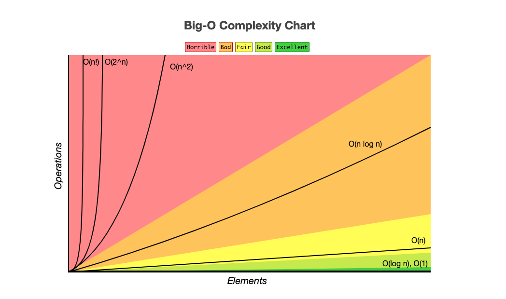

# Big O - Asymptotic Complexity (O(x))

### All code has a complexity, like:

- **O(log n) - Logaritmics** → Performatic, option to loop performatively. **Example**: binary search.

- **O(1) - Constant** -> Complexity doesn't change independent of the input param. **Example**: `IF`

- **O(n) - Linear** → More values, less performance. **Example**: `FOR`.

- **O(n²) - Exponencial** → Repetition inside repetition. Will repeat each element again. **Example**: `FOR` inside `FOR`.

- **O(n³)**

- **O(2^n)**

- **O(3^n)**

- **O(n!) - Fatorial** -> The worst.  **Example**: Recursive function. 

___

| Big O Notation | Type        | Computations for 10 elements | Computations for 100 elements | Computations for 1000 elements  |
| -------------- | ----------- | ---------------------------- | ----------------------------- | ------------------------------- |
| **O(1)**       | Constant    | 1                            | 1                             | 1                               |
| **O(log N)**   | Logarithmic | 3                            | 6                             | 9                               |
| **O(N)**       | Linear      | 10                           | 100                           | 1000                            |
| **O(N log N)** | n log(n)    | 30                           | 600                           | 9000                            |
| **O(N^2)**     | Quadratic   | 100                          | 10000                         | 1000000                         |
| **O(2^N)**     | Exponential | 1024                         | 1.26e+29                      | 1.07e+301                       |
| **O(N!)**      | Factorial   | 3628800                      | 9.3e+157                      | 4.02e+2567                      |

___

___

# Data Structure Operations Complexity

| Data Structure          | Access    | Search    | Insertion | Deletion  | Comments  |
| ----------------------- | :-------: | :-------: | :-------: | :-------: | :-------- |
| **Array**               | 1         | n         | n         | n         |           |
| **Stack**               | n         | n         | 1         | 1         |           |
| **Queue**               | n         | n         | 1         | 1         |           |
| **Linked List**         | n         | n         | 1         | n         |           |
| **Binary Search Tree**  | n         | n         | n         | n         | In case of balanced tree costs would be O(log(n)) |
| **AVL Tree**            | log(n)    | log(n)    | log(n)    | log(n)    |           |