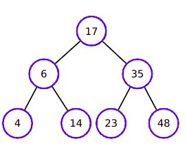

# 🎄 Trees

- Trees has similar to the **node structure** of lists
- The **principal** node is called **Root**
- **Below**, we have the **subtrees**
- Each node has a node pointing to him

___

## 🤔 Examples of uses

- HTML structure
- Folders
- Interfaces
- **RL** example: a tree.

___

- All nodes has **0 or more children**
- All nodes has just **one father**
- The **node degree** is defined by the **number** of **children** what he have
- Nodes with the **same father** are **brothers**
- Nodes with **degree zero** can be called **leaf**
- **Path**: A sequence of nodes. The **size** of this **path** is the **number of arcs**
- **Depth:** To each node of a tree, exists a **unique path between root and this node**. The **size** of this **path** is called Depth.
- **Height:** The **depth max** in any node

___

# Types of Search

- **Post order:** `left -> right -> root` (down to up)
- **Pre order:** `root -> left -> right` (hierarchy) 
- **In order:** `left -> root -> right` (crescent)

# Binary Tree

- A binary tree has **bellow each node, maximum** of **2 subtrees.**
- Each node has **1 key** and **2 pointers**, one for the subtree in **left** and one for subtree in **right**

___
    

___

# AVL Tree

- This method is used to **auto balancing** the trees with **rotations**, making the module of `heightLeft - heightRight` be **less than 1** (balanced). In AVL trees, we register the **node height**.

- **Right rotation**: The **left** subtree is heavy
- **Left rotation**: The **right** subtree is heavy
- **Left Right rotation**: The **Node** heavy in **left** and **subtree** heavy in **right**. Makes a **left rotation** and a **right rotation**.
- **Right Left rotation**: The **node** heavy in **right** and **subtree** heavy in **left**. Makes a **right rotation** and a **left rotation**.

___

___

### Being **B** the **Imbalance Factor** (`leftHeight - rightHeight`):

- `B > 1` and `key < root.left.key`: **Right rotation**.
- `B < -1` and `key > root.right.key`: **Left rotation**.
- `B > 1` and `key > root.left.key`: **Left Right rotation**.
- `B > -1` and `key < root.right.key`: **Right Left rotation**.